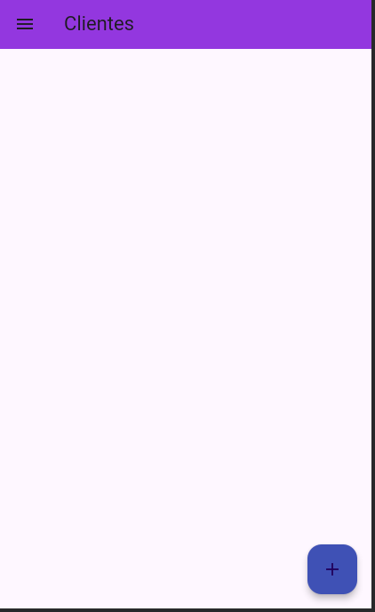
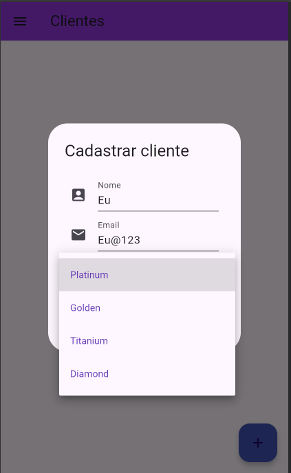
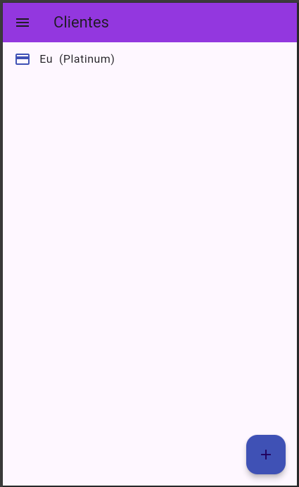
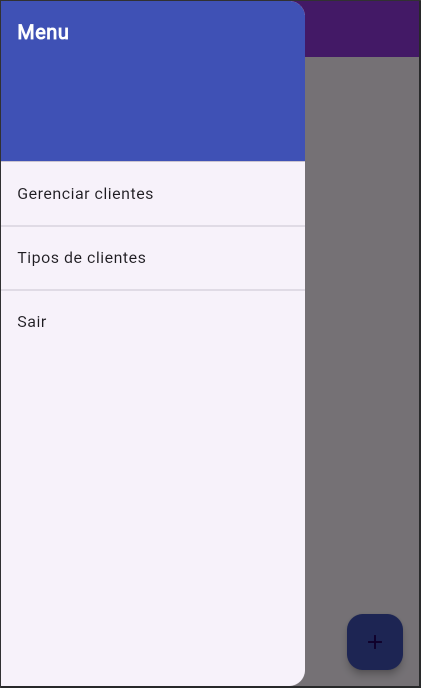
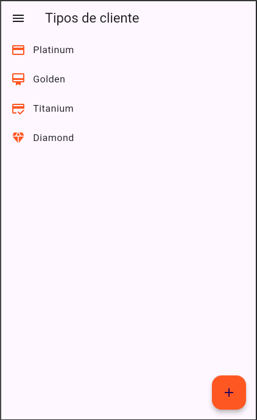
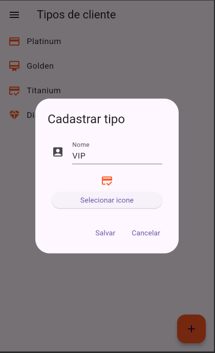
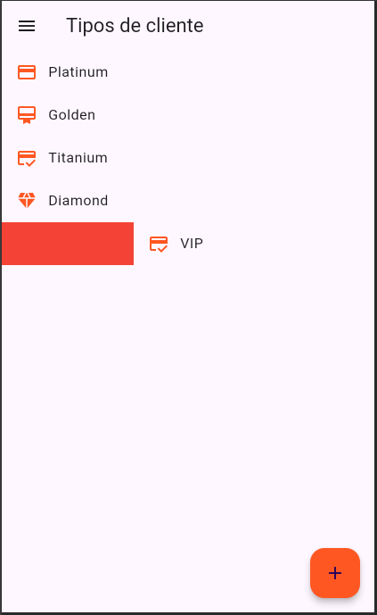

# Entendendo Provider

## Gerenciando Clientes

Nesse projeto foi desenvolvido uma aplicação de gerenciar clientes, com a ideia de que quando clicarmos em um botão nos consigamos adicionar um novo cliente, passando nome, email e tipo de cliente, e então após adicionar ele possamos excluir arrastando para o lado. Também temos um menu lateral para adicionar um tipo, ler um tipo, editar um tipo. Isso tudo salvando o estado da aplicação sem que os dados gravados sejam excluídos após uma troca de tela

- Tela inicial

- Após clicar no botão para cadastrar cliente, passando nome, email e tipo

- Após salvar

- Menu lateral

- Tela para adicionar/remover tipos de clientes

- Adicionando tipo de cliente

- Removendo um item arrastando para o lado

